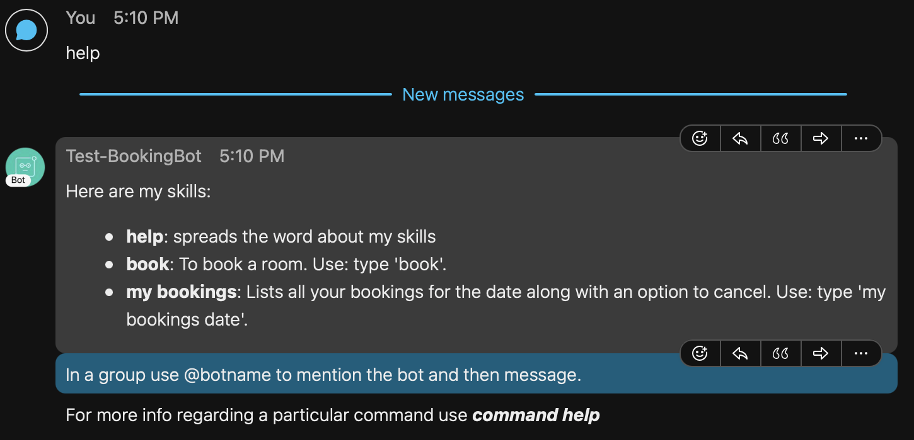
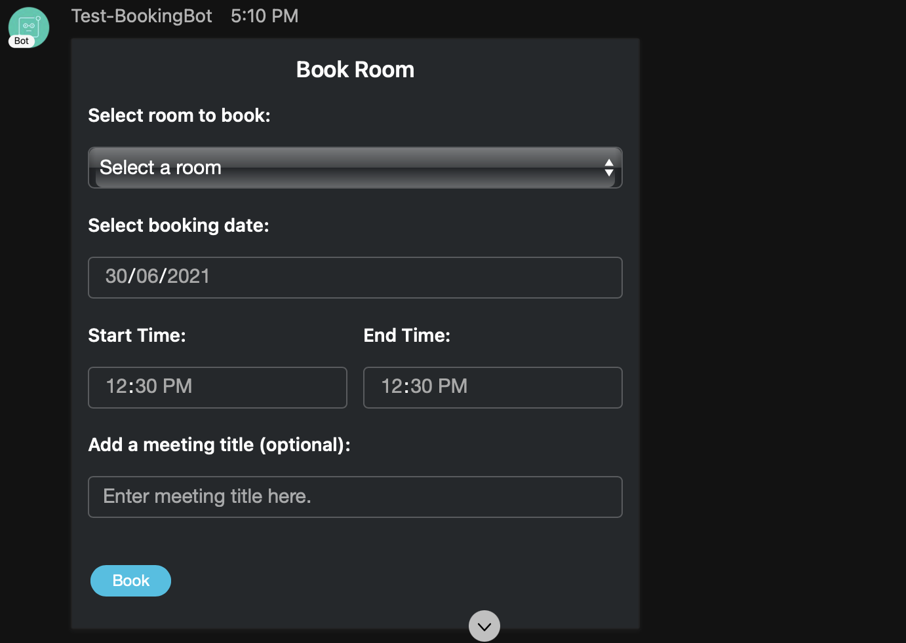
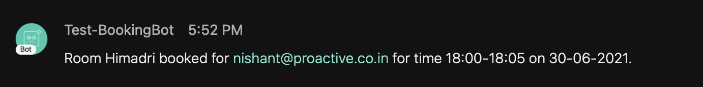
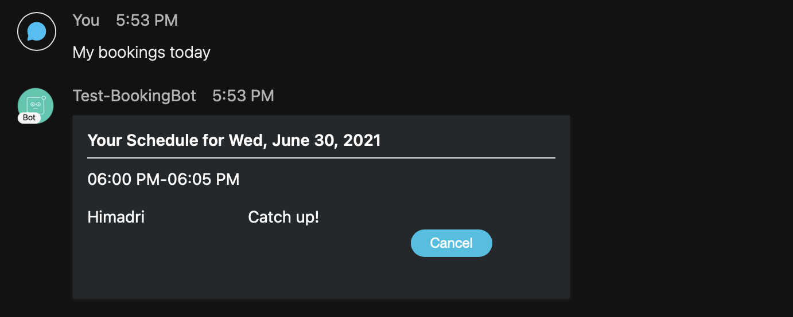
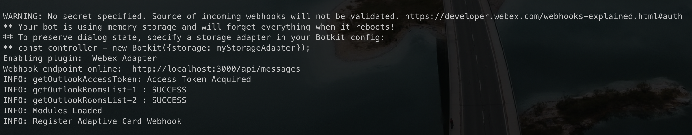

# Room Booking Bot

The room booking bot is designed for easing the process of booking a room via Webex Teams. The bot is integrated with Microsoft Outlook Calendar and Webex Teams with the help of REST APIs and provides a form based process for booking, cancelling, checking schedules of rooms and also user's own schedule for the day.

## Here how it works:

- You can check what the bot can do using `help` command.
    

- For booking a room you start with `book` command. Fill in the details. And click Book. 
    

- You should receive confirmation message and email shortly.
    

- Your schedule for the day can be checked using `my bookings` command.
    

## Technology used
Languages: JavaScript (Node.js).  
Frameworks: Botkit.  
Status:  v1.0


## Installation

1. Clone this repository or download the ZIP file.
    ```sh
    git clone https://github.com/proactive-data-systems/Room-Booking-Bot.git
    ```
2. Log into https://developer.webex.com and create a new webex app. Guide: https://developer.webex.com/docs/bots#creating-a-webex-bot. Store these somewhere safe: Bot Client ID, Client Secret, Access Token and Bot Name.
3. For the Microsoft Outlook requirements follow this guide: https://docs.microsoft.com/en-us/graph/auth-v2-user#3-get-a-token. Store these somewhere safe: Bot email (Outlook), Tenant ID, Client ID, Client Secret.
5. Go to project root folder and install Node.js dependencies.
    ```sh
    npm install
    ```
4. If using ngrok to test the bot. Expose port 3000 of your machine starting ngrok.
    ```sh
    ngrok http 3000
    ```
    Save the 'Forwarding' HTTPS (not HTTP) address generated by ngrok.
5. Edit the `.env` file with the required fields. For eg:
    ```sh
    # These values are random just for showing an example.
    ACCESS_TOKEN=abcd
    PUBLIC_URL=https://abcde.ngrok.io
    PORT=3000
    
    LIMIT_TO_DOMAIN=xyz.co.in
    AUTHORIZED_PERSON=abc@xyz.co.in
    BOT_NAME=Roomie
    
    MAIL_EMAIL_ID=bot@outlookemail
    MAIL_EMAIL_PASS=password
    MAIL_PORT=587
    MAIL_HOST=smtp-mail.outlook.com
    MAIL_CIPHER=SSLv3
    
    OUTLOOK_BOT_EMAIL=bot@outlookemail
    OUTLOOK_GRAPH_BASE_URI=https://graph.microsoft.com/v1.0
    OUTLOOK_GRAPH_TENANT_ID=efgh
    OUTLOOK_GRAPH_CLIENT_ID=hijk
    OUTLOOK_GRAPH_CLIENT_SECRET=lmnop
    OUTLOOK_GRAPH_SCOPE=https://graph.microsoft.com/.default
    OUTLOOK_GRAPH_GRANT_TYPE=client_credentials
    ```
6. To start the bot.
    ```sh
    npm start
    ```
7. Output should be like this.
    

## Getting help

If you have questions, concerns, bug reports, etc., please create an issue against this repository.

## Licensing

See file [LICENSE](./LICENSE).
